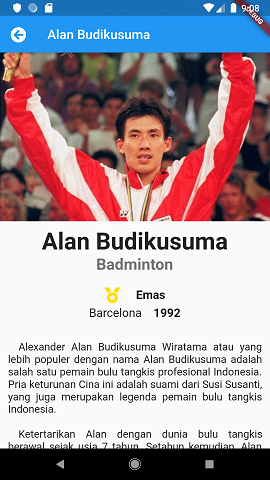

# TUGAS 03 OSG05 EUDEKA! - HAORNAS 2019
Aplikasi Flutter mendapatkan dan menampilkan Gridview atlet penerima medali Olimpiade

### Screenshot




### Built With
- [Flutter](https://flutter.dev)

### Created By
- [ffaradyc](https://github.com/ffaradyc)

---

### Class Athlete

```dart
class Athlete {
  String _name;
  String _foto;
  String _sports;
  Medal _medal;
  String _olympic;
  int _year;
  String _description = "";
  final _silver = const Color(0xC0C0C0);
  final _gold = const Color(0xFFDF00);
  final _bronze = const Color(0xcd7f32);

  Athlete(this._name, this._foto, this._sports, this._medal, this._year,
      this._olympic,
      [this._description = ""]);

  String get name {
    return _name;
  }

  String get sports {
    return _sports;
  }

  String get foto {
    return _foto;
  }

  String get olympic {
    return _olympic;
  }

  int get year {
    return _year;
  }

  String get description {
    return _description;
  }

  Color get medalColor {
    switch (_medal) {
      case Medal.gold:
        return _gold.withOpacity(0.8);
        break;
      case Medal.silver:
        return _silver.withOpacity(0.8);
        break;
      case Medal.bronze:
        return _bronze.withOpacity(0.8);
        break;
      default:
        return Colors.black.withOpacity(0.8);
        break;
    }
  }

  String get medalText {
    switch (_medal) {
      case Medal.gold:
        return "Emas";
        break;
      case Medal.silver:
        return "Perak";
        break;
      case Medal.bronze:
        return "Perunggu";
        break;
      default:
        return "";
        break;
    }
  }
}
```
Source Code dapat dilihat [disini](https://github.com/ffaradyc/flutter_haornas/blob/master/lib/data/athletes.dart)

### Gridview with builder

```dart
class LandingPage extends StatelessWidget {
  final listItem = athletes;
  @override
  Widget build(BuildContext context) {
    return Scaffold(
      appBar: AppBar(
        title: Text('Atlit Peraih Medali Olimpiade'),
        leading: Icon(FontAwesomeIcons.trophy),
        backgroundColor: Colors.deepPurple,
      ),
      body: GridView.builder(
        itemCount: listItem.length,
        gridDelegate:
            SliverGridDelegateWithFixedCrossAxisCount(crossAxisCount: 2),
        itemBuilder: (BuildContext context, int index) {
          return _WidgetAthlete(listItem[index]);
        },
      ),
    );
  }
}
```

### Widget Athlete (GridTile berdasarkan data yang diambil dari data athletes)
```dart
class _WidgetAthlete extends StatelessWidget {
  final Athlete athlete;
  _WidgetAthlete(this.athlete);

  @override
  Widget build(BuildContext context) {
    return Padding(
      padding: const EdgeInsets.all(4.0),
      child: InkWell(
        onTap: () {
          Navigator.push(
            context,
            MaterialPageRoute(
              builder: (BuildContext context) {
                return DetailPage(athlete);
              },
            ),
          );
        },
        child: Container(
          decoration: BoxDecoration(
            color: Colors.white70,
            boxShadow: [
              BoxShadow(
                color: Colors.black45,
                offset: Offset(3, 3),
                blurRadius: 6,
              ),
            ],
            border: Border.all(
              color: Colors.blueGrey,
              width: 2,
              style: BorderStyle.solid,
            ),
          ),
          child: GridTile(
            header: Container(
              padding: EdgeInsets.all(8.0),
              color: Colors.black.withOpacity(0.3),
              child: Text(
                athlete.name,
                textAlign: TextAlign.center,
                style: TextStyle(fontWeight: FontWeight.w500, fontSize: 16.0, color:Colors.white),
              ),
            ),
            footer: Container(
              padding: EdgeInsets.all(8.0),
              color: athlete.medalColor,
              child: Text(
                athlete.sports,
                textAlign: TextAlign.center,
                style:
                    TextStyle(color: Colors.black, fontWeight: FontWeight.bold),
              ),
            ),
            child: Image.asset(athlete.foto, fit:BoxFit.cover),
          ),
        ),
      ),
    );
  }
}
```
Source Code dapat dilihat [disini](https://github.com/ffaradyc/flutter_haornas/blob/master/lib/landingpage.dart)


### Detail Page
```dart
class DetailPage extends StatelessWidget {
  final Athlete data;

  DetailPage(this.data);
  @override
  Widget build(BuildContext context) {
    return Scaffold(
      appBar: AppBar(
        leading: IconButton(
          onPressed: () {
            Navigator.pop(context);
          },
          icon: Icon(FontAwesomeIcons.arrowCircleLeft),
        ),
        title: Text(
          data.name,
          textAlign: TextAlign.center,
        ),
      ),
      body: SingleChildScrollView(
        child: Column(
          children: <Widget>[
            Image.asset(
              data.foto,
              fit: BoxFit.cover,
            ),
            SizedBox(height: 10),
            Text(
              data.name,
              style: TextStyle(
                fontSize: 36,
                fontWeight: FontWeight.bold,
              ),
            ),
            Text(
              data.sports,
              style: TextStyle(
                fontSize: 24,
                fontWeight: FontWeight.bold,
                color: Colors.black54,
              ),
            ),
            SizedBox(
              height: 20,
            ),
            Row(
              mainAxisAlignment: MainAxisAlignment.center,
              children: <Widget>[
                Icon(FontAwesomeIcons.medal,
                    color: data.medalColor.withOpacity(1.0), size: 24),
                SizedBox(
                  width: 24.0,
                ),
                Text(
                  data.medalText,
                  style: TextStyle(fontSize: 18.0, fontWeight: FontWeight.bold),
                ),
              ],
            ),
            SizedBox(
              height: 5,
            ),
            RichText(
              text: TextSpan(
                text: data.olympic,
                style: TextStyle(color: Colors.black87, fontSize: 18.0),
                children: <TextSpan>[
                  TextSpan(text: "    "),
                  TextSpan(
                    text: data.year.toString(),
                    style: TextStyle(fontWeight: FontWeight.bold),
                  ),
                ],
              ),
            ),
            SizedBox(
              height: 20,
            ),
            Padding(
              padding: const EdgeInsets.all(12.0),
              child: Text(
                data.description,
                textAlign: TextAlign.justify,
                style: TextStyle(fontSize: 16.0),
              ),
            ),
          ],
        ),
      ),
    );
  }
}
```
Source Code dapat dilihat [disini](https://github.com/ffaradyc/flutter_haornas/blob/master/lib/detailpage.dart)


### Info Lebih Lengkap
Website : [www.eudeka.id](https://www.eudeka.id)  
Twitter: [@EudekaID](https://twitter.com/EudekaID)  
Telegram : [@eudekainfo](https://t.me/eudekainfo)  
Instagram : [@eudeka.id](https://instagram.com/eudeka.id)  
WhatsApp : [0895351577557](https://wa.me/62895351577557)  
Email : [info@eudeka.id](mailto:info@eudeka.id)  

---

###### tags: `Flutter` `Eudeka` `OSG05`